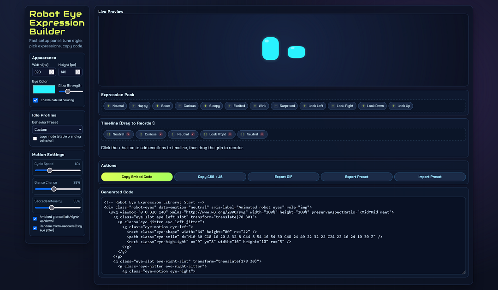

# Robot Eye Expression Builder

A compact, embeddable SVG robot eye animation builder for playful UI states, brand mascots, and lightweight motion systems.

## Preview

## What it does

Robot Eye Expression Builder lets you design animated robot eyes with a simple HTML/CSS/JS workflow. It includes expression presets, motion controls, a live preview, timeline ordering, and quick export options for embedding into other projects.

## Features

- Multiple eye expressions: neutral, happy, beam, curious, sleepy, excited, wink, surprised, and directional looks
- Smooth animated transitions between expressions
- Randomized natural blink timing
- Ambient glance and micro-saccade controls
- Timeline workflow: add from Expression Pack, drag to reorder, remove chips
- Live preview with quick single-expression preview
- Generated embed code panel
- Transparent GIF export
- Export/import preset JSON
- Copy full embed code or CSS + JS only
- Logo mode for restrained brand-safe motion

## Files

- `index.html` - builder UI
- `style.css` - all layout and styling
- `app.js` - animation logic and code generation
- `Preview.png` - project preview image used in this README

## How to use

1. Open `index.html` in a browser.
2. Pick a preset or customize width, color, motion, and expressions.
3. Reorder the timeline by dragging chips.
4. Copy the generated embed code into your site.

## Notes

- The project is intentionally framework-free.
- The generated output is self-contained and suitable for embedding.
